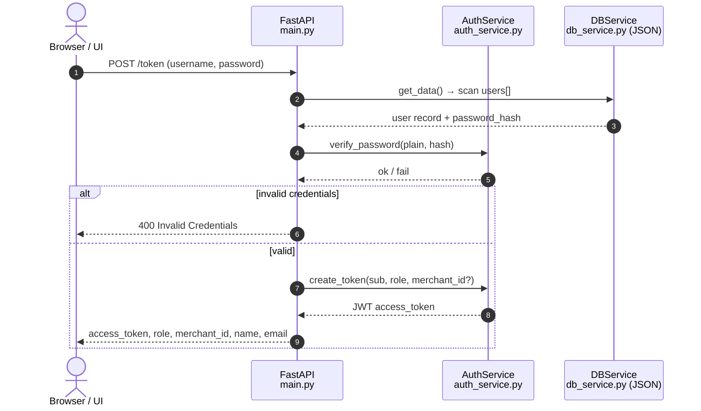
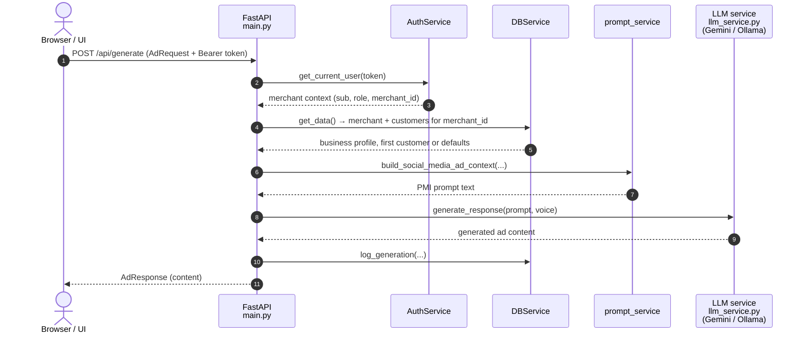
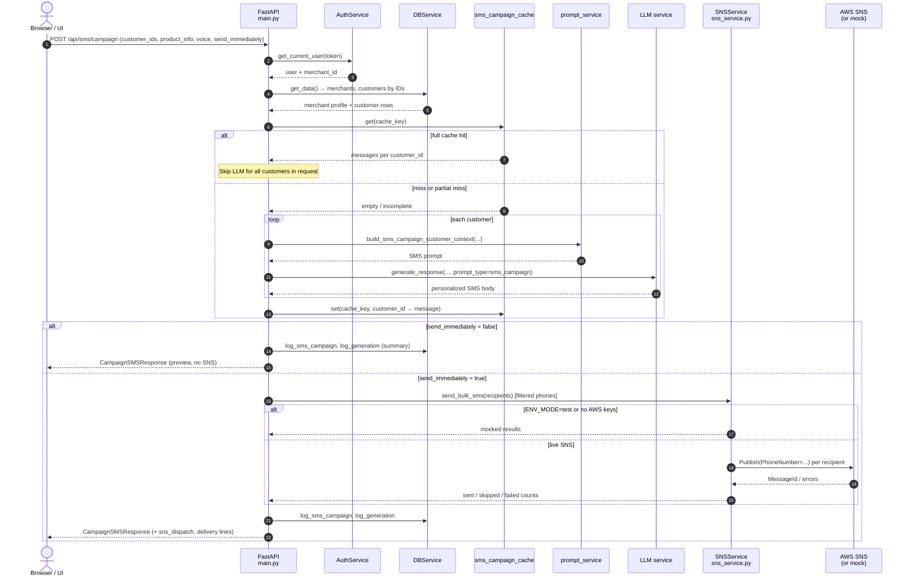
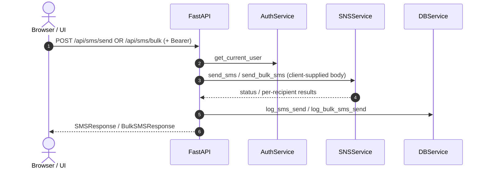

# AdPulseAI — sequence diagrams

Render these blocks in any Mermaid-capable viewer (GitHub, Cursor preview, [mermaid.live](https://mermaid.live)).

## 1. Authentication (`POST /token`)

## 2. Personalized social ad (`POST /api/generate`)

Authenticated requests send `Authorization: Bearer <JWT>` (OAuth2 bearer). `get_current_user` decodes the token on each call.

## 3. SMS campaign (`POST /api/sms/campaign`)

Covers optional **file-backed generation cache**, per-customer LLM messages, optional **immediate SNS bulk send**, and logging.

## 4. Single / bulk SMS (no LLM)

---

**Legend:** JSON “database” is loaded via `db_service`; LLM backend is chosen by admin settings / environment (see `llm_service.py`). SNS uses direct `Publish` to phone numbers; optional `SNS_ALLOWED_PHONES` can restrict which numbers hit AWS in live mode.
