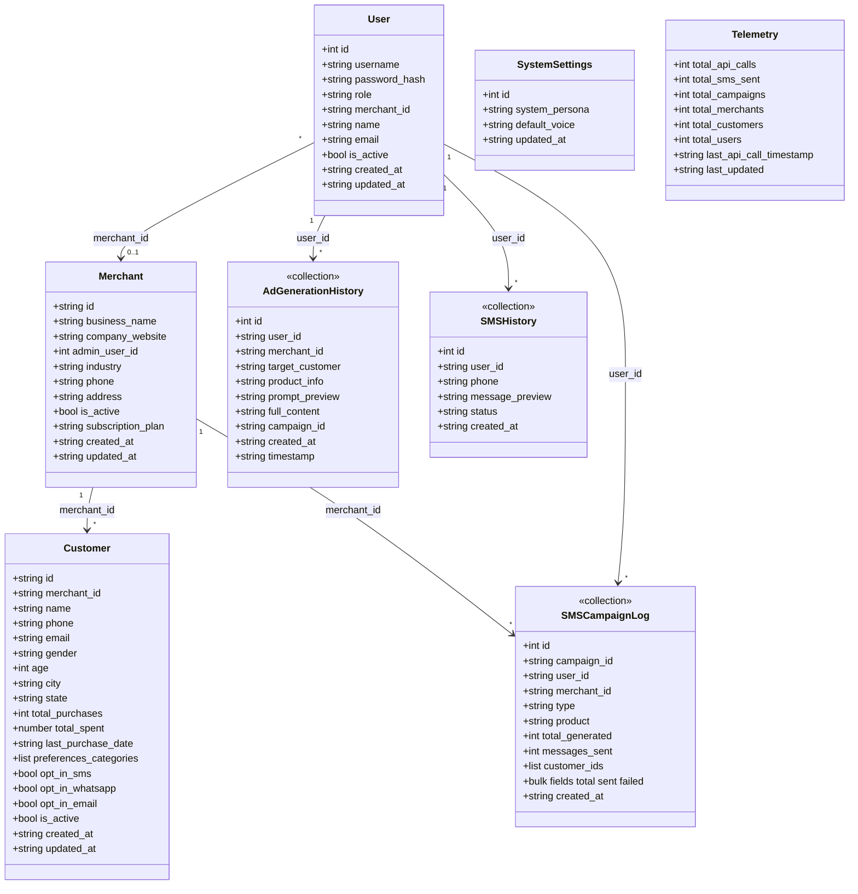

# AdPulseAI — Service & Entity class model (UML / Mermaid)

Paste into [mermaid.live](https://mermaid.live) or any Markdown preview that supports Mermaid.

---

## 1. Service class model

Python service layer in `api/services/`. **Prompt building** is implemented as module-level functions in `prompt_service.py` (used internally by LLM services via `build_generation_prompt`); not a class.

```mermaid
classDiagram
    direction TB

    class AuthService {
        +verify_password(plain, hashed) bool
        +hash_password(password) str
        +create_token(data dict) str
        +get_current_user(token) Async JWT payload
        +get_user_merchant_id(username) optional
    }

    class DBService {
        -file_path str
        +get_data() dict
        +get_user_by_username(username) dict?
        +get_user_history(username, role, merchant_id) list
        +get_customers_for_merchant(merchant_id) list
        +log_generation(...)
        +log_sms_send(...)
        +log_bulk_sms_send(...)
        +log_sms_campaign(...)
    }

    class SettingsService {
        -file_path str
        +get_settings() dict
        +save_settings(new_settings dict)
    }

    class SNSService {
        -client boto3 / None
        +dispatch_mode() str
        +send_sms(phone, message) dict
        +send_bulk_sms(recipients list~dict~) dict
    }

    class SMSCampaignGenerationCache {
        +get(key str) dict~str,str~?
        +set(key str, by_customer_id dict) void
    }

    class BaseAdService {
        <<abstract>>
        +generate_response(product_info, voice, prompt_type)* str
    }

    class OllamaAdService {
        -model str
        -_client OllamaClient
        +generate_response(...) str
    }

    class GeminiAdService {
        -model str
        -_client genai.Client
        +generate_response(...) str
    }

    class MockLlmService {
        +generate_response(...) str
    }

    BaseAdService <|-- OllamaAdService
    BaseAdService <|-- GeminiAdService
    BaseAdService <|-- MockLlmService

    OllamaAdService --> SettingsService : persona / defaults
    GeminiAdService --> SettingsService : persona / defaults

    AuthService ..> DBService : reads users via db_svc\nin login flow
    Note for AuthService: OAuth2PasswordBearer;\njwt.decode in get_current_user

    Note for DBService: Persists to schemas/db.json\n(users, merchants, customers,\nhistory, campaigns, telemetry)

    Note for SNSService: Optional SNS_ALLOWED_PHONES;\nmock when ENV_MODE=test\nor missing AWS keys

    Note for SMSCampaignGenerationCache: File .sms_campaign_gen_cache.json;\nLRU cap via env

    note for BaseAdService "Concrete impl chosen by get_llm_service()\nin llm_service.py (env + settings)."
```

### Typical use by `main.py` (not drawn as classes)

- **Depends on:** `auth_svc`, `db_svc`, `get_llm_service`, `get_settings_service`, `sns_service`, `sms_campaign_generation_cache`, plus `build_*` helpers from `prompt_service`.

---

## 2. Entity class model

Two layers: **domain records** stored in `db.json`, and **API DTOs** (Pydantic) in `api/schemas/`.

### 2a. Domain entities (JSON document)

These are not Python classes; attributes reflect the persisted shape used by `DBService`.



### 2b. API / transport entities (Pydantic)

```mermaid
classDiagram
    direction TB

    class AdRequest {
        +string product_info
        +string voice
    }

    class AdResponse {
        +string status
        +string content
    }

    class SettingsUpdate {
        +string system_persona
        +string default_voice
    }

    class SMSRecipient {
        +string phone
        +string name
        +string message
    }

    class SMSSendRequest {
        +string phone
        +string message
    }

    class BulkSMSRequest {
        +List~SMSRecipient~ recipients
    }

    class CampaignSMSRequest {
        +string product_info
        +string voice
        +List~string~ customer_ids
        +bool send_immediately
    }

    class SMSResponse {
        +string status
        +string message
        +string phone
        +string message_id
    }

    class BulkSMSResponse {
        +string status
        +int total
        +int sent
        +int failed
        +int skipped
        +List~dict~ results
    }

    class SNSDeliveryLine {
        +string status
        +string phone_tail
        +string detail
        +string message_id
    }

    class CampaignSMSResponse {
        +string status
        +string campaign_id
        +int total_customers
        +int messages_generated
        +bool send_requested
        +int messages_sent
        +int messages_skipped
        +int messages_failed
        +bool from_cache
        +string sns_dispatch
        +List~SNSDeliveryLine~ sns_delivery_results
        +List~dict~ preview
    }

    BulkSMSRequest "1" *-- "*" SMSRecipient : recipients
    CampaignSMSResponse "1" *-- "*" SNSDeliveryLine : sns_delivery_results
```



---

## Relationship summary

| Layer | Role |
|--------|------|
| **Services** | Orchestration, auth, persistence IO, LLM adapters, SNS, campaign cache |
| **Domain entities** | Long-lived data in `db.json`; scoped by `merchant_id` where applicable |
| **Pydantic entities** | Request/response contracts for REST endpoints |
