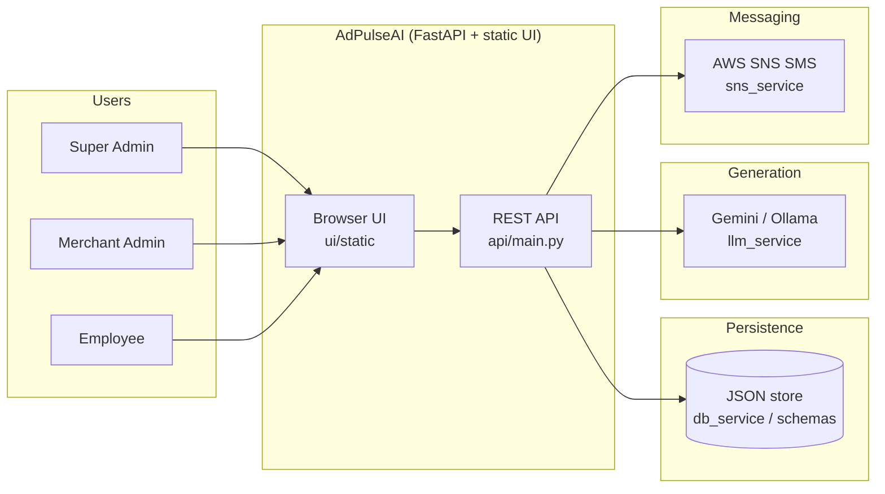
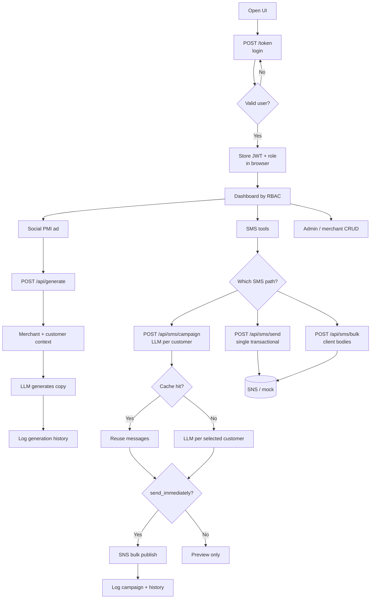
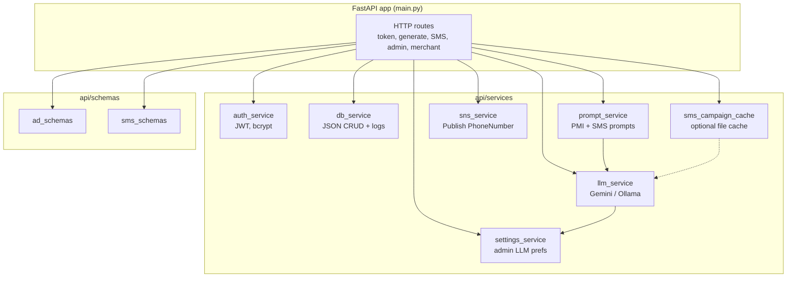
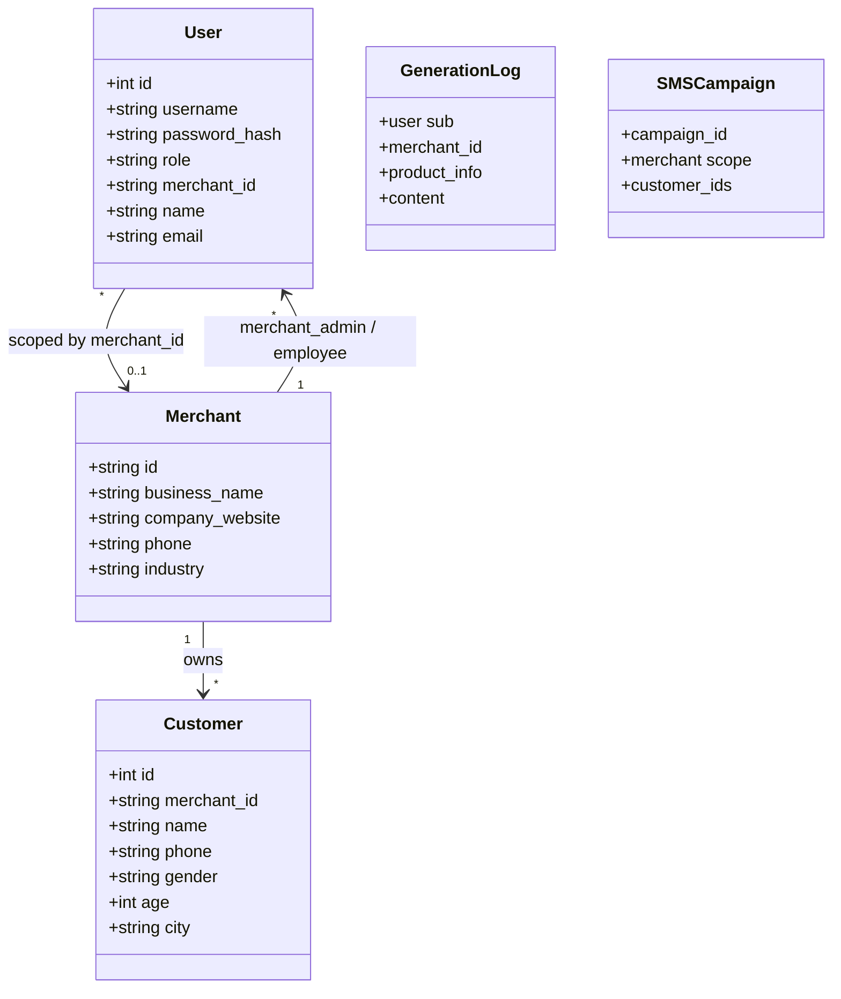
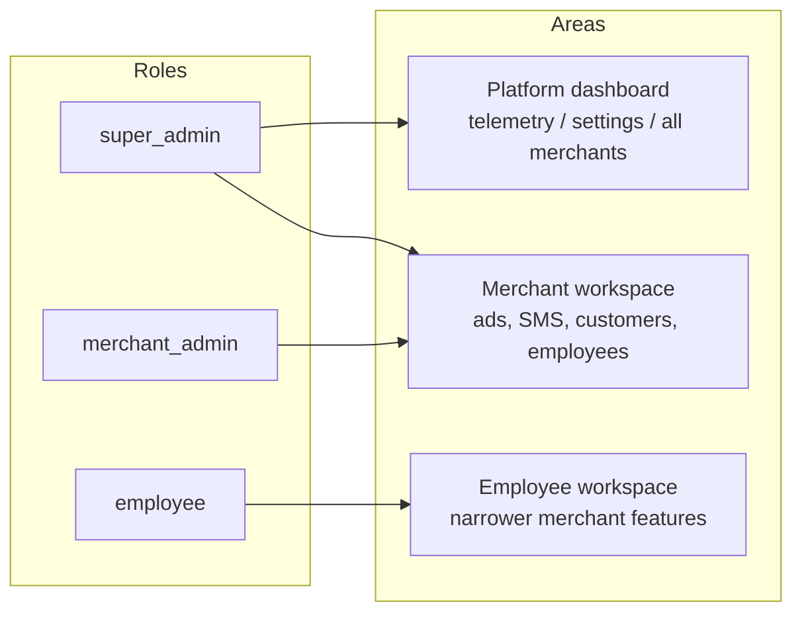
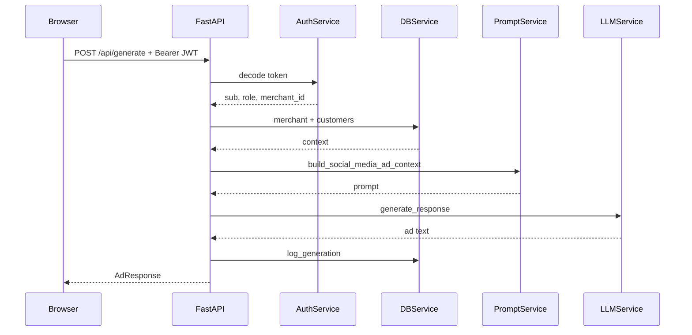
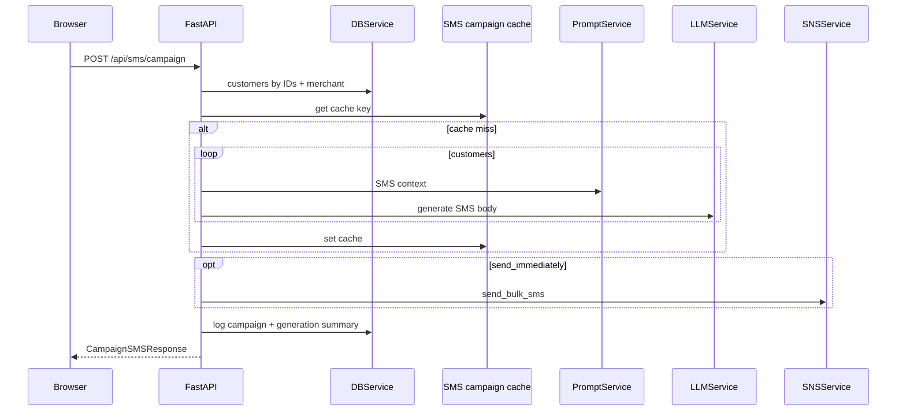

# AdPulseAI — Mermaid UML-style diagrams

Paste any block into [mermaid.live](https://mermaid.live) or a Markdown preview that supports Mermaid.

---

## 1. Project overview (system context)

High-level actors and external systems.

---

## 2. End-to-end application flow

Typical journey from login through campaigns.

---

## 3. Component diagram (backend layers)

Logical modules inside the API package.

---

## 4. Domain model (simplified class diagram)

Mirrors main collections in the JSON store and request/response shapes (not every field).

---

## 5. RBAC vs API surface (overview)

Which roles typically reach which areas (approximate; some endpoints enforce extra checks in code).

---

## 6. Sequence — authenticated PMI generation (summary)

---

## 7. Sequence — SMS campaign (summary)

---

More granular sequence diagrams (including `/token` and raw SMS) live in [`SEQUENCE_DIAGRAM.md`](./SEQUENCE_DIAGRAM.md).
